---
# stuff
theme: default
info: a
title: Using Godot for mixed-reality livestreaming
# apply unocss classes to the current slide
class: text-center
# https://sli.dev/features/drawing
drawings:
  persist: false
# enable MDC Syntax: https://sli.dev/features/mdc
mdc: true
---

# Using Godot for mixed-reality livestreaming

(it's not as scary as it sounds)

<!--
The last comment block of each slide will be treated as slide notes. It will be visible and editable in Presenter Mode along with the slide. [Read more in the docs](https://sli.dev/guide/syntax.html#notes)
-->

---
---

# what does that mean

`mix(real_camera, virtual_camera, 0.5)`

<div class="relative flex items-center justify-center">
  
  <span class="text-9xl ml-5 mr-10">+</span>
  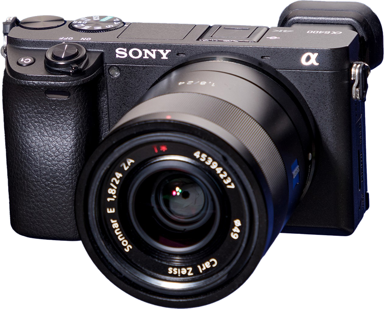
</div>

---
layout: image
---

# what does that mean

`mix(real_camera, virtual_camera, 0.5)`

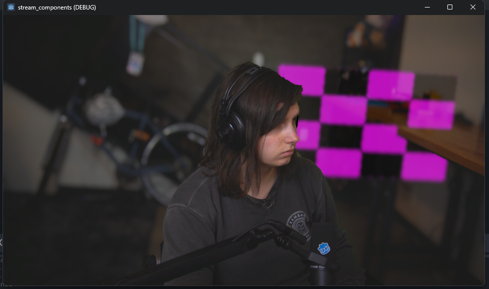

---

# what this talk isn't

(a very good talk)

- not a talk about godot XR
- no headsets or trackers are involved

<!--
add an image
-->

---
layout: image-right

image: badcop.png
backgroundSize: 20em
---

# who am i?

not actually a cop

- sarah a.k.a. "badcop"
- godot user for 5 years
- mostly game jams
- twitch streamer (software and game dev)

---

# software and game dev on twitch

there are dozens of us!

- variety of programming and game development content
- fairly small category

<div  class="relative">
  <div v-click>
most streams looks like this:
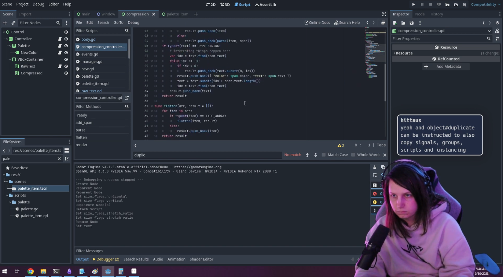
    </div>

<span v-after class="absolute text-[#FA0101] font-[Comic_Sans_MS] ml-145 mt--20 text-6xl">kinda<br>boring</span>
</div>

---
---

# could it be more visually interesting?

<div class="relative flex justify-center mt-10">
  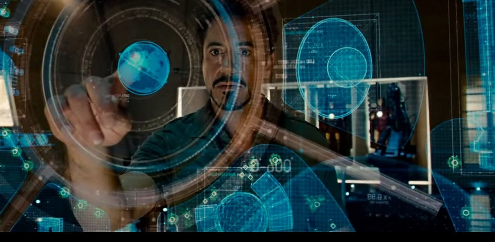
  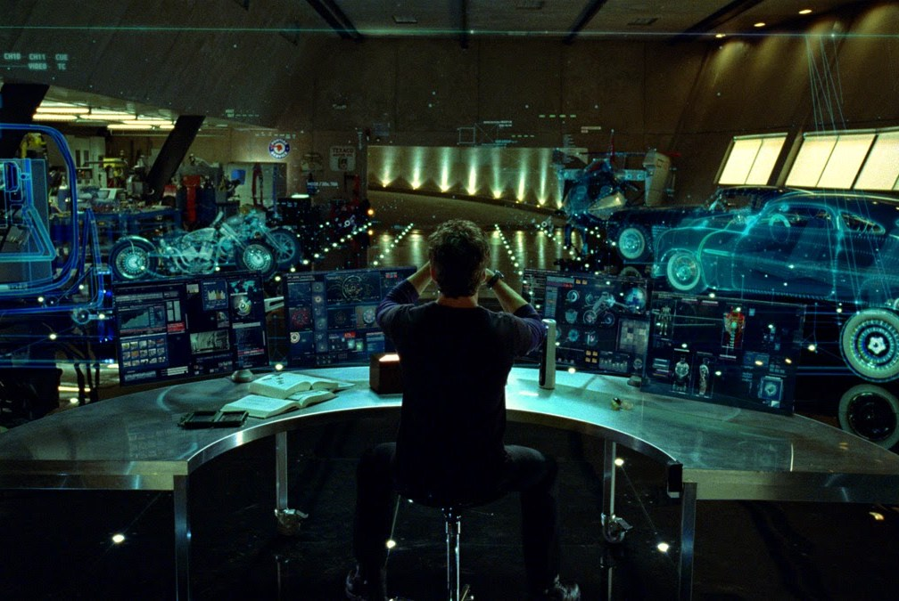
  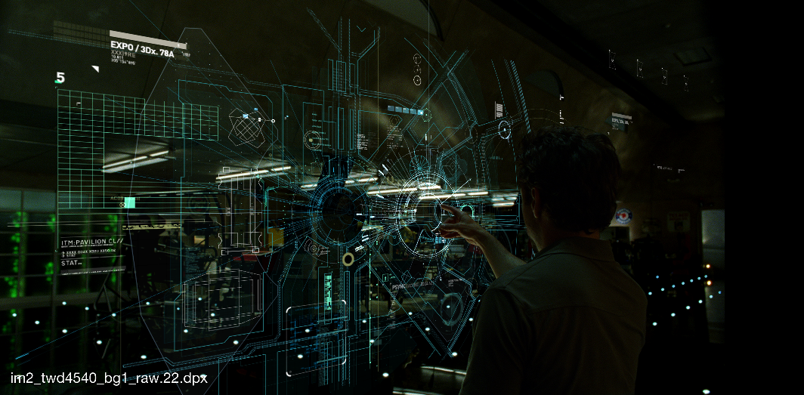
</div>
<!--
move the not a video production expert

add another slide here with the iron man stuff
-->

---
layout: quote
---

# i don't know how to do that stuff...

---
layout: quote
---

<div class="flex flex-1 items-center justify-between">

# ...but i *am* a game developer


</div>

<!--
maybe the solution is to stop thinking about streaming like video production, and start thinking about it like game development
-->

---
layout: cover
---

<SlidevVideo src="./public/demo.mp4" autoplay loop autoreset='slide' />

---
---

<SlidevVideo src="./public/trippy.mp4" autoplay autoreset='slide' />

---

# why godot?

*"but why male models?"*

- which is easier: bring 3D into OBS, or bring OBS features into Godot?
- scripting in Godot is a way nicer experience than OBS
- Godot is open source and easily extensible
- bonus points: i'm already familiar with it

<!--
consider deleting this slide

talk about what is OBS
-->

---
---


# initial goal

the plan is simple

<v-after>1. capture my camera and desktop in Godot<br></v-after>
<v-click>2. create a 3D scene out of that somehow<br>
</v-click>
<v-click>3. render the final stream output in Godot<br>
</v-click>
<v-click>4. still use OBS for audio / encoding / streaming<br>
</v-click>

<v-click><br><br><br>5. it only needs to work on Windows (sorry)</v-click>

---

# step 1: camera capture

the unapologetic cheating begins

using spout-gd for now

talk about camera extension

add a slide for GPU->CPU->GPU explanation

spent some time trying to fix this, then realized "you know what, good enough"

---

# segmentation

fancy word for "separate the background"

<div class="relative justify-center flex">
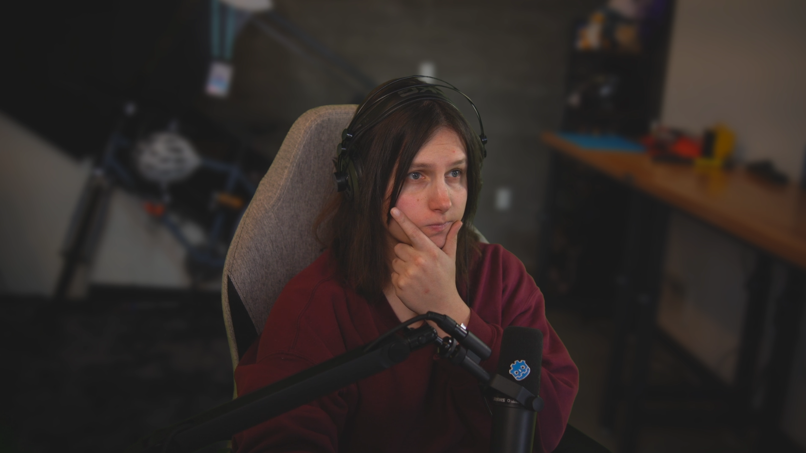
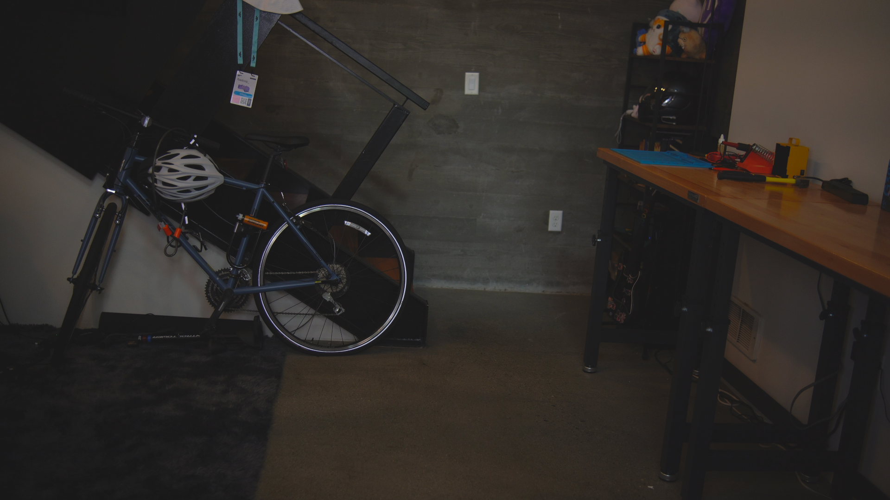
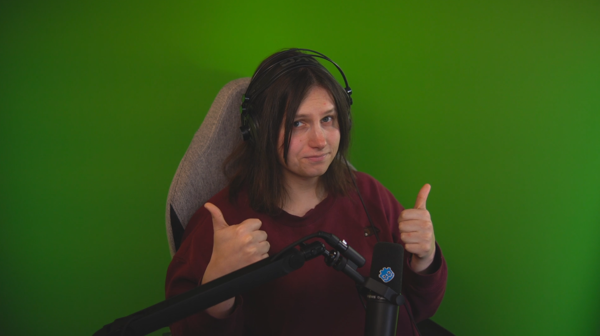
</div>

---
---

# segmentation

fancy word for "separate the background"

<div class="flex justify-center gap-5 mt-20">

  <span class="text-9xl">+</span>
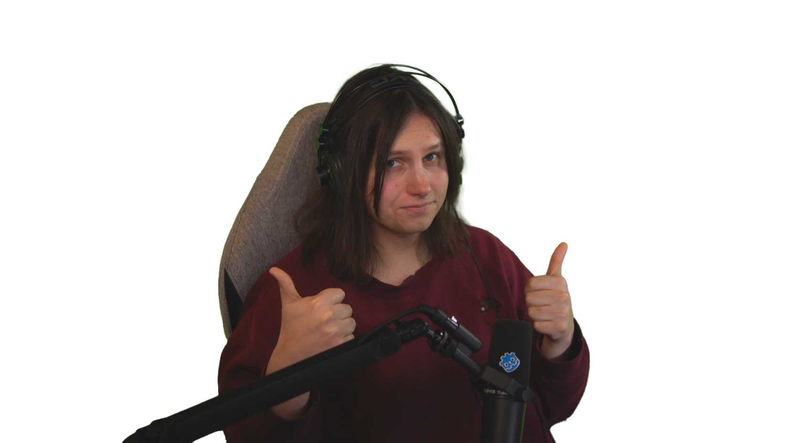
  </div>

---
---

# it looks bad.

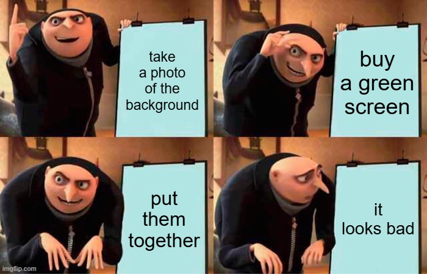

---
layout: two-cols
---

# why?

- real cameras are imperfect
- random noise in the image that changes each frame

<br>
<v-click>

## we can fix it!

```glsl
// generates noise
float random (vec2 st) {
    return fract(sin(dot(st.xy,
         vec2(12.9898,78.233)))*
        43758.5453123);
}

void fragment() {
  float tex = texture(camera, UV).rgb;
  float rand = mod(random(UV) + TIME * 2.0, 1.0);
  ALBEDO = tex + vec3(rand) * 0.004;
}
```
</v-click>

::right::

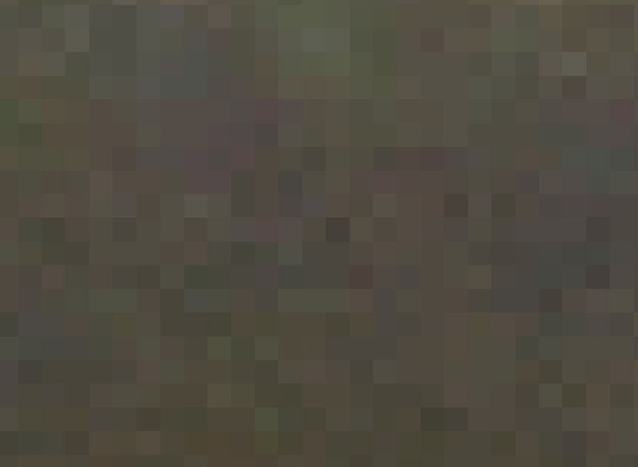

---
---

# step 2: make it 3D

- simple blockout using blender
- tape measure

---
---

# projection un-mapping

not a very exact science

- there was some tool i forgot tho

---

# re-projecting

---
---

# depth of field blur

- it just works!

---
---

# step 3: window capture

- window capture in godot

---
---

# floating windows

- window capture in godot
- transparency sorting hell

---
---

# deep dive: packing floats

make some cool visuals

---
---

# hand tracking

lots of options (and they're all mediapipe)

<v-click>

- GDMP: gdextension (c++)
  - easiest to setup
  - ❌ no GPU support on windows

</v-click>
<v-click>

- python
  - ❌ also no GPU support on windows

</v-click>
<v-click>

- run mediapipe in the browser
  - ✅ GPU support on windows!
  - can talk to Godot via websocket
  - [code on github](https://github.com/cgsdev0/mediapipe-js)

</v-click>


<SlidevVideo src="./public/hands.mp4" autoplay loop class="w-100 absolute top-40 right-15"/>

---
---

# what's next

- physics objects
- more integrations with twitch chat / redeems
- doing more with hand tracking

---
---

# final thoughts

special thanks to...
### Code help
- StaydMcmuffin
- LainVT

<br>

### Inspiring streamers
- CR4ZYK1TTY
- JDDoesDev
- Venorrak
- LCOLONQ
